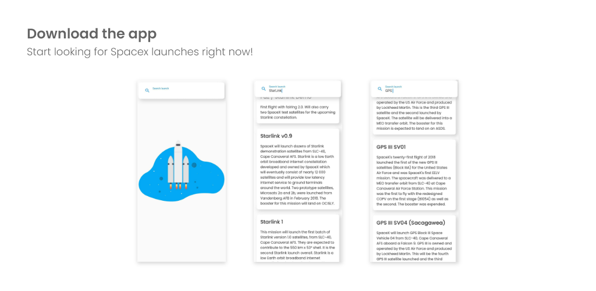

# Spacex.land Client

A Flutter spacex.land client to search for launches.



<a href="https://play.google.com/store/apps/details?id=lorenzo.gangemi.spacex_land_client"></a>

## Installation

- Clone the repo
  ```sh
  git clone https://github.com/GangemiLorenzo/Spacex.land-Client.git
  ```
- Make sure you have a mobile device on which to install the app connected to your computer.
- Build and run the project
  ```sh
  cd Spacex.land-Client
  flutter pub get
  flutter run
  ```
